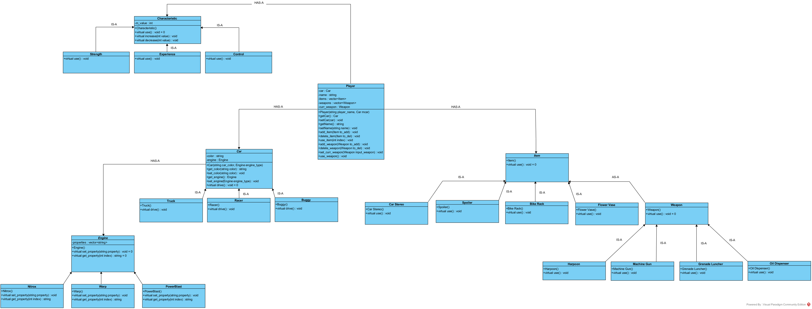

### Problem 1: Class Structures and Inheritance

#### NOTE: I have not shown any of the destructors but needles to say that every class has a destructor.
#### There might be a better choise for some of the variable types, given more precise information (i.e. properties of the Engine)

#### I have ommited some of the variables in the classes since this clearly is not a full implementation and some details have been ommited.

**IS-A**: Public inheritance
**AS-A**: Private inheritance

The player **HAS-A** Car (the variable itself is a pointer of type Car - **UML doesn't show pointers**).
* the car variable is pointer of type Car and the player can both call a function (getCar()) to see which car is in use currently or change into a new car (setCar()).
* The player constructor sets the car pointer to a previously created Car. I have additionally added a player name as a property of the Player class.

The Car class is Abstract and all of the car types are derived from it. Therefore, every car type **IS-A** Car.
* The Car **HAS-A** Engine.
* The Car constructor takes a color and sets the color variable, as well an Engine object and sets the engine type of the newly created car. The car class allows for the engine type to be changed.
* All of the inherited car types have their own drive styles, so there is a function implemented for all of them.

The Engine class is an Abstract class and all of the Engines are derived from it. It also has a property vector which to which properties can be added or taken away. 

The player **HAS-A** Item and **HAS-A** Weapon. All of the items are derived from the Abstract class Item (**IS-A**). Each item has variables for their functionalities (*NOT SHOWN IN THE UML DIAGRAM*). Since these parameters are different each class implements its own use() function.

All the weapons inherit from the Abstract class Weapon (**IS-A**), which in itself is derived from an Item, since weapons are items in themselves. Therefore Weapon is used **AS-A** Item. Similarly, to the items each derived weapon has variables for the functionalities (*NOT SHOWN IN THE UML DIAGRAM*). 
* The curr_weapon holds the weapon in use (since we can only use one at the time), and there are functions that call the use() funcitons of the weapon and item objects. Potentially, this could be one function but there are two seperate use functions for the sake of clarity.

The Player also **HAS-A** Characteristic. Similarly to the other classes there are different properties for the characteristics which can be implemented or decremented. Since the value is the same for all of the inherited classes can call the increase() and decrease() functions of the parent class.

The diagram can be found under the */img* folder: https://github.com/usc-csci104-spring2016/hw_trajkovs/blob/master/hw5/img/inheritance.png

